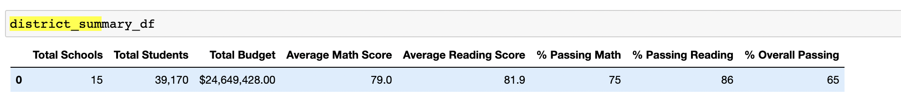

# School_District_Analysis

## Overview of the School District Analysis:

### The goal of this project was to assist a school board. There was evidence of academic dishonesty by 9th graders at Thomas High School. To uphold state testing standards, we need to remove the Thomas High 9th graders reading and math scores keeping the rest of the data intact. From there we will rerun our analysis of the schools to see how the changes affected the overall analysis of the schools.

## School District Results:

### Removing the 9th graders from Thomas caused the test scores and percentages for the district overall to fall marginally, all less than 1%:

### Original District data

### Post removal of Thomas 9th graders

### Removing the 9th graders from Thomas caused Thomas High's test scores and percentages to fall (with exception of the reading score with increased 0.05). All else fell a few fractions of a percent, a larger drop than the district at large, all less than 1% with the reading percentages falling the most:

### Original District data

### Post removal of Thomas 9th graders

## Summary 
### Removal of the 9th graders caused Thomas to fall in rankings compared to its district peers. Since their fraud artifically inflated the scores, removal of that data caused Thomas to look worse. School spending analysis made it appear Thomas is spending more for worse results, made medium size schools look worse as it pulled down averages for the category, and also affected the Charter school group as well. 

### Thomas High's removal of fradulent scores and replacements with NaNs proves the old saying that crime doesnt pay.
